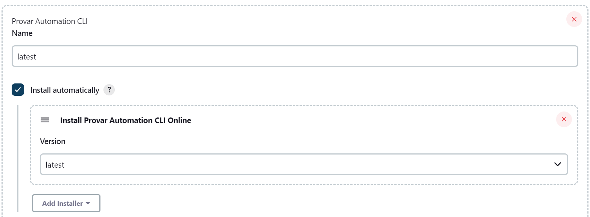
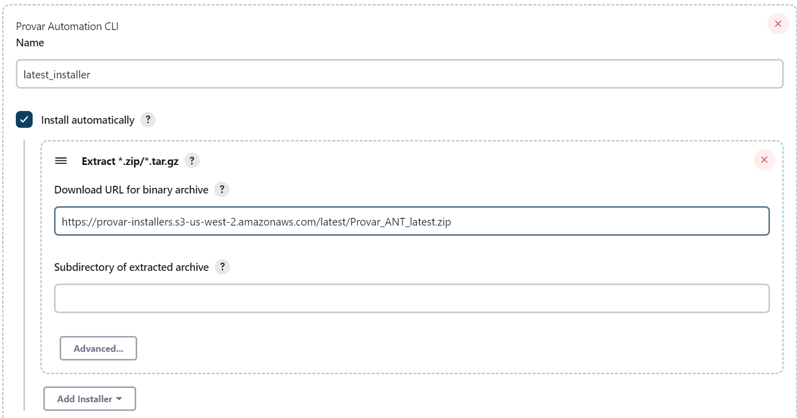
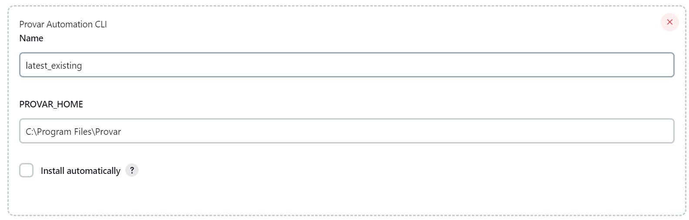
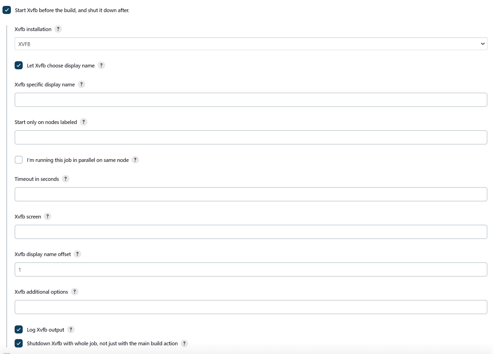
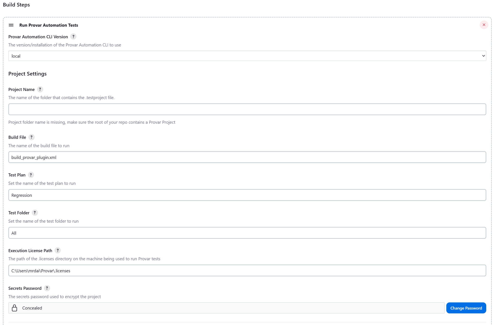

# Provar Plugin for Jenkins
## Introduction
The purpose of this plugin is to set up and configure an environment to be able to 
run Provar Automation Tests with limited manual effort.
The plugin allows for automatic installation of the Provar Automation CLI via tool configuration. 
There is also Global Tool configuration for JDK, ANT, and XVFB (Linux Only) which must be done separately (if not already setup).
In the future there will be additional browser installations, more parameters for builds, and ProvarDX support as well.
## Getting started
### Pre-requisites
- In order to use this plugin, you will first need a working Provar Automation project checked into a valid version control system.
- You will also need a properly configured build file. You'll find two examples in the `source-files` directory. One is for Test Plan configuration, the other for test folder(s).
- It is always recommended that your Provar Automation project be encrypted prior to check in!
- Minimum Jenkins version required is 2.387.3
  - [Subject to change per Jenkins recommendation](https://www.jenkins.io/doc/developer/plugin-development/choosing-jenkins-baseline/#changing-the-minimum-required-version)
### Installation
- For this plugin to be used, a valid Provar Automation CLI Installation must be specified in the Jenkins `Global Tool Configuration`.

#### Automatic Installation:
- In order for the automatic installers to appear in the Global Tool Configuration, you will need to copy the `sources-files/io.jenkins.plugins.ProvarAutomation.ProvarAutomationInstaller` file into your `$JENKINS_HOME/updates` directory. This will require a page refresh to take effect.
- This installer file will be updated to reflect any new publicly available versions of the Provar Automation CLI.
- Latest will always point to the latest Provar Automation CLI version publicly available.

- Alternatively, you can configure an automatic installer using an extract configuration.
  - If you do not have the ability to replace files on your Jenkins instance, then this method is preferred.
  - All installer links are available here: `source-files/io.jenkins.plugins.ProvarAutomation.ProvarAutomationInstaller`.
  
#### Manual Installation:
- You can configure the plugin to use an existing installation of either the Provar Automation CLI or full Provar Automation.

#### JDK Configuration:

- **Requires Oracle Account in order to install JDK automatically.**
- Provar 2.9.2+ requires the usage of JDK 11.
- [Oracle JDK Plugin GitHub](https://github.com/jenkinsci/jdk-tool-plugin/)

#### ANT Configuration:

- Recommended version: 1.10.X
- [ANT Plugin GitHub](https://github.com/jenkinsci/ant-plugin)

#### XVFB Configuration (_Required Linux OS Only_):

- **Note you cannot install XVFB automatically without a valid URL**
- Linux Distribution Specific Installations (_may require sudo override_):
  - Debian/Ubuntu
    - `apt-get upgrade && apt-get install`
    - `apt-get install xvfb`
  - Alpine Linux
    - `apk add xvfb-run`
  - Red Hat
    - `yum install xvfb` 
OR 
    - `yum install xorg-x11-server-Xvfb` 
  - [XVFB Plugin GitHub](https://github.com/jenkinsci/xvfb-plugin)

_Browser Installations must be handled separately, this plugin assumes you will only be testing browsers that are properly installed and accessible from the PATH_
### Usage
**Build Environment**

- **Provar Automation CLI Version**: Whatever version you set here will be installed on the machine if not already installed.

**Build Step Configuration**

**Project Settings**
- **Provar Automation CLI Version**: Provar Installation to use. See above section. The version you select here will be used for the task itself.
- **Project Name**: The project folder containing the Provar test project. Leave blank if the of your root repository contains the .testproject file. The project path must be relative to the Jenkins workspace directory.
- **Build File**: Build file to use. If left blank, plugin will look for `build.xml` in the `ANT` directory. Otherwise, looks in the `ANT`
directory of the `Project Name` folder for the named build file.
- **Test Plan**: Test Plan to use. Plugin will look in the `plans` directory of the Provar Project folder for the named Test Plan. Full relative paths can be used (i.e. `Regression/Sales Cloud/Account`)
- **Test Folder**: The Test Folder to include in the test run. Plugin will look in the `tests` directory of the Provar Automation Project for the folder. Full relative paths can be used (i.e. `Regression/Sales Cloud/Opportunity`)
- **Execution License Path**: The folder containing the license file. Plugin will look in the $USER_HOME/Provar/.licenses folder by default.
- **Secrets Password**: The Provar Secrets Password used to encrypt/access the Provar Project. This value is kept secret and masked in all logs.

**Environment Settings**

- **Browser**: The target browser to run your tests on. _Browser selected from the picklist must be installed on the machine prior to job execution._

- **Environment**: The test environment to use. Can be left blank to use the default environment.

**Cache/Results Settings**

- **Salesforce Metadata Cache Setting**: The cache setting to use when accessing Salesforce Metadata.

- **Test Results Path Setting**: How the `ANT/Results` folder will be handled in subsequent job executions.

#### _More Build Step parameters to come in future releases or per request_
### Build this project
- In order to build the project, you will need to follow [this](https://www.jenkins.io/doc/developer/tutorial/prepare/) guide on how to set up your local environment to build Jenkins plugins.
- In short, you need Java 11 and Maven installed in order to build the project using the command `mvn hpi:hpi`. This will generate the *.hpi file needed to install the plugin.
- To install the plugin via the *.hpi file, follow the Jenkins [Documentation](https://www.jenkins.io/doc/book/managing/plugins/), starting from the *Advanced Installation* section.
## Issues
- Report issues and enhancements in the [GitHub issue tracker](https://https://github.com/mrdailey99/provar-automation-jenkins/issues).
- Additionally, all Provar users should raise a case with the Customer Success team via the Success Portal.
## Contributing
Contributions are always welcome and encouraged! You can contribute by referring to the [contribution guidelines](https://github.com/jenkinsci/.github/blob/master/CONTRIBUTING.md).
## LICENSE
Licensed under MIT, see [LICENSE](LICENSE.md)
